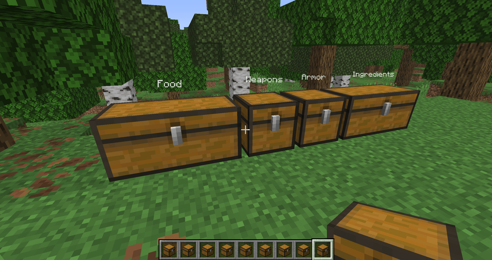

# Storage Container Labels

A mod that displays labels above named chests in Minecraft.

## Features

- Display labels above named chests
- Works for both single and double chests
- Configurable render distance, label size, opacity, color, and position offset

## Usage

Use an anvil to rename a chest to whatever you want. Place the chest and its name will be displayed as a floating label attached to it. If Mod Menu is installed, you can customize how the labels are rendered.

### Examples

## Dependencies

**Required**
- [Fabric Loader](https://fabricmc.net/use/) ≥ 0.19.3
- [Fabric API](https://modrinth.com/mod/fabric-api) ≥ 0.151.0+26.1.2

**Optional**
- [ModMenu](https://modrinth.com/mod/modmenu) - for configuration (not strictly necessary if defaults work for you)
    - [Cloth Config](https://modrinth.com/mod/cloth-config)