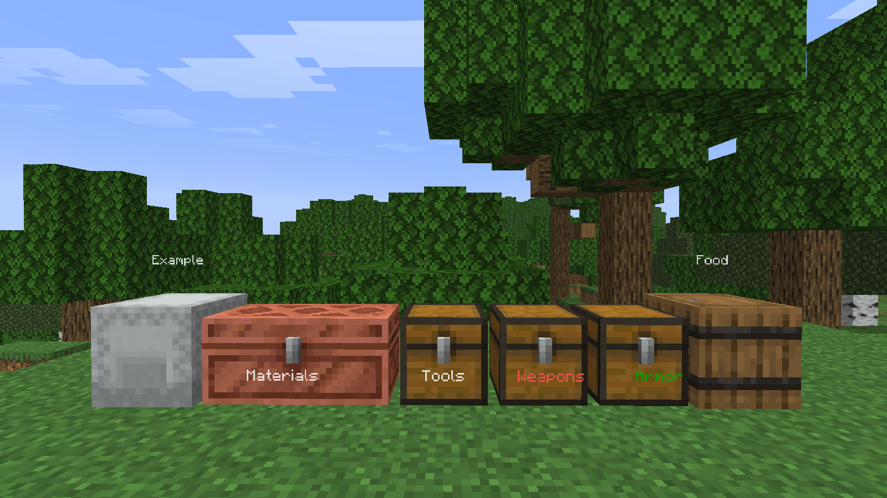
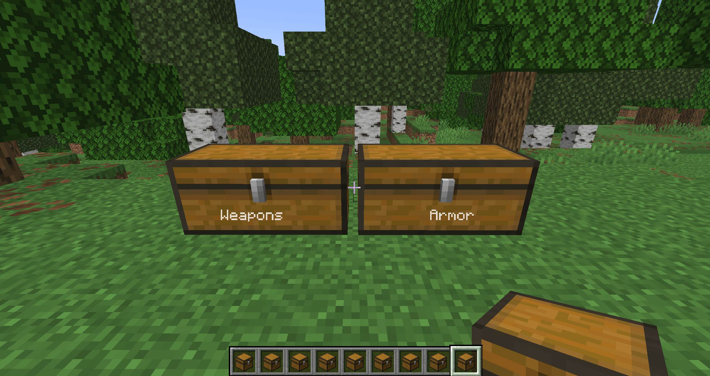

# Storage Container Labels

A mod that displays labels above/around named storage containers in Minecraft.

## Features

- Works with:
    - Single and double chests
    - Chest variants
    - Barrels
    - Shulker boxes
    - Hoppers
    - Droppers
    - Dispensers
- Enable or disable per type
- Configurable render distance, size, opacity, offset, fading and visibility

## Usage

Use an anvil to rename a storage container to whatever you want. Place the container and its name will be displayed as a floating label attached to it. If Mod Menu is installed, you can customize the appearance of the labels.

### Examples

## Dependencies

**Required**
- [Fabric Loader](https://fabricmc.net/use/) ≥ 0.19.3
- [Fabric API](https://modrinth.com/mod/fabric-api) ≥ 0.151.0+26.1.2

**Optional**
- [Mod Menu](https://modrinth.com/mod/modmenu) - for configuration (not strictly necessary if defaults work for you)
    - [Cloth Config](https://modrinth.com/mod/cloth-config)